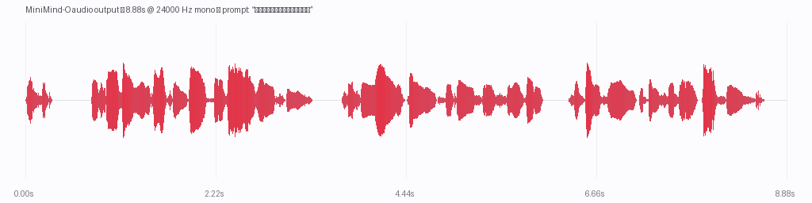

# nanovllm-omni

[简体中文](README.zh-CN.md)

[](https://github.com/MciG-ggg/nanovllm-omni/actions/workflows/ci.yml)
[](LICENSE)
[](.)
[](.)

- 🎯 **MiniMind-O pipeline** — smallest full Thinker → Talker → Code2Wav runtime that loads real `jingyaogong/minimind-3o` weights
- ⚡ **Full three-stage E2E ~0.65–1.04 s total median on RTX 3050 (4 GB)** — one prompt → thinker → talker → MTP → Mimi → WAV, real `jingyaogong/minimind-3o` + `kyutai/mimi` weights, torch 2.14.0+cu130, re-measured 2026-09 on the full-only tree. All six bench prompts, 20 runs each: **628–1038 ms total median** (short ~0.63 s, medium ~0.75 s, system ~1.04 s), p95 ≤ 1.11 s, VRAM peak ~1881 MiB. Numbers + raw CSV in `docs/perf/tk005-rtx3050.md` / `docs/perf/full-e2e-rtx3050.csv`.
- 🔧 **Thinker-decode bench primitive (for regression, not the production path)** — `bench time` (default) measures the single-thinker decode stage only: ~177 ms total median with `--use-thinker-cuda-graph`, ~483 ms eager, on the same box. That number does **not** include the talker/MTP/Mimi stages and must not be quoted as end-to-end latency.
- 🔁 **StagePool pattern (single-replica in-process)** — per-stage continuous batching via `RuntimeScheduler`; multi-replica + RoundRobin LB removed after measuring `num_replicas=1 == num_replicas=2` (`tests/test_batched_runner_contract.py`)
- 🌐 **Unified omni I/O contract** — same `OmniRequestOutput` envelope for MiniMind-O (audio) + SmolVLM (text) + SD-Turbo (image) + SmolVLA (action)

A small, local reference implementation that exercises vllm-omni's stage-based serving architecture on a single card. This project does not claim to implement vllm-omni's full feature set.




## How this differs from `nano-vllm` and `nanovllm`

There are two other Python projects with `nano-vllm`-style names; they are
**not** the same thing:

| Project | Modalities | Goal |
|---|---|---|
| `nanovllm-omni` (this repo) | audio / image / action / text | aligned omni-modal runtime that mirrors vllm-omni's consumer-visible API on a single 4 GB card |
| [`GeeeekExplorer/nano-vllm`](https://github.com/GeeeekExplorer/nano-vllm) | text only | minimal educational re-implementation of vLLM's text path |
| [`zhx-llm/nanovllm`](https://github.com/zhx-llm/nanovllm) | text only | another educational text-only vLLM reimplementation |

If you arrived here searching for a *text-only* mini-vLLM, the two repos
above are what you want.

## A name-sharing peer project

[`Rising0321/nano-vllm-omni`](https://github.com/Rising0321/nano-vllm-omni) is
an independent `nano-vllm-omni` project that happens to share our repository
name *and* our Python package name (`nanovllm_omni`). It is **not** a fork
and **not** a re-implementation of this repo — it's a peer, picked by
someone else, with a different scope.

| Axis | `MciG-ggg/nanovllm-omni` (this repo) | `Rising0321/nano-vllm-omni` |
|---|---|---|
| Modalities | audio, image, VLM-text, action | video (I2V / TI2V) |
| Model families | MiniMind-O, SD-Turbo, SmolVLM, SmolVLA | Wan2.2-TI2V-5B only |
| Hardware target | RTX 3050 4 GB, single process | RTX 3090 24 GB, single process + CPU offload |
| Pipeline shape | per-family stage factory inside one `Omni(...)` | explicit step-wise scheduler (`request → scheduler → runner → pipeline`) |
| Aligned with | `vllm-omni` consumer-visible API | `vllm-omni` diffusion stage contract (`prepare_encode → denoise_step → step_scheduler → post_decode`) |

Both projects are independent educational reads of `vllm-omni`; neither is
a fork of the other. If you arrived here looking for the **video I2V /
Wan2.2** path, the Rising0321 repo is what you want.

> **Heads-up:** both projects ship a Python package named `nanovllm_omni`.
> Installing them in the same virtualenv will conflict; use separate
> environments.

## Supported models

| Model | Stages | Output | Weights |
|---|---:|---|---|
| MiniMind-O (`minimind-3o`) | 3 (Thinker → Talker → Code2Wav) | audio (24 kHz mono WAV) | `jingyaogong/minimind-3o` + `kyutai/mimi` |
| SmolVLM-500M-Instruct | 1 (VLM) | text | `HuggingFaceTB/SmolVLM-500M-Instruct` |
| SD-Turbo | 1 (DIFFUSION, 1-step) | image (512×512 PNG) | `stabilityai/sd-turbo` |
| SmolVLA | 1 (LLM_GENERATION) | action chunks | `HuggingFaceVLA/smolvla_libero` + LIBERO datasets |

All four run on a single 4 GB consumer card (RTX 3050) in one process. Image generation, video generation, vision LLMs beyond SmolVLM, full VLA stacks, and full-duplex S2S are aspirational and are not implemented.

## Gallery

Real outputs from each of the four aligned model families on a single RTX 3050 (4 GB) card. Audio and image use the local weight snapshots under `~/minimind-3o`, `~/mimi`, and the HF cache; SD-Turbo + SmolVLM weights must be pre-provisioned (`hf download …`) since the loader is offline-first.

### MiniMind-O — audio (24 kHz mono WAV)

<audio controls src="docs/gallery/minimind_o_1.wav"></audio>

The longest local sample (~8.88 s, ~386 KB) — generated by the bundled Thinker → Talker → Code2Wav pipeline. On a 4 GB card, keep `max_tokens ≤ 16` to avoid OOM during the Mimi codec forward pass. Source: `examples/offline_inference/minimind_o/`.

### SD-Turbo — image (512×512 PNG)

Two samples, all 1-step diffusion at `guidance_scale=0.0`:


> `a misty mountain valley at sunrise, oil painting, 8k`


> `a glass teapot with steam rising, on a wooden table, studio photo`

SD-Turbo's adversarial distillation locks `guidance_scale=0.0` and `num_inference_steps=1`; passing other values degrades quality. Source: `examples/offline_inference/sd_turbo/`.

### SmolVLM-500M-Instruct — text (image + text → text)

> **Image**: `docs/images/sd_turbo_sample.png` (512×512 PNG, generated by SD-Turbo — the cat in the same image above)
>
> **Prompt**: `What is in this image and what art style is it rendered in?`
>
> **Response**:
>
> > There is a cat in the image. The image is a photograph.

At 500 M parameters the answers are short and the art-style question resolves to a single class (`photograph`) rather than a description. A larger VLM would elaborate. Source: `examples/offline_inference/smolvlm/`. Full transcript saved at [`docs/gallery/smolvlm_0.md`](docs/gallery/smolvlm_0.md).

### SmolVLA — action chunks (LIBERO eval replay)

<video controls src="docs/gallery/smolvla_0.mp4" width="480"></video>

LIBERO eval episode; the LLM_GENERATION stage emits an action chunk (`numpy.ndarray` of shape `[chunk_size, action_dim]`). This video is the chunk driven through the LIBERO simulator. Source: `examples/offline_inference/smolvla/libero_eval.py`.

## Quickstart

Install the package and its existing dependencies; add the `minimind`
extra for the audio path (torch/transformers) and `.[smolvla]` for the
SmolVLA examples:

```bash
pip install -e ".[dev,minimind]"
```

For MiniMind-O (audio), pull the weights once into local directories
(the bundle loader is offline-first and never auto-fetches):

```bash
hf download jingyaogong/minimind-3o --local-dir "$HOME/minimind-3o"
hf download kyutai/mimi             --local-dir "$HOME/mimi"
```

Then run the single-prompt smoke against the local weights:

```bash
cd examples/offline_inference/minimind_o
HF_HUB_OFFLINE=1 bash run_end2end.sh \
    --model "$HOME/minimind-3o" --mimi "$HOME/mimi" --out audio.wav
```

`audio.wav` lands in the example folder. A CUDA-capable machine with
at least 4 GB of VRAM is recommended; CPU inference works but is
slow.

For SD-Turbo (image), SmolVLM (text), and SmolVLA (action), see the
per-family examples under `examples/offline_inference/<family>/`.

The aligned API is available across all four families:

```python
from nanovllm_omni import Omni, SamplingParams

# Audio (MiniMind-O)
engine = Omni("jingyaogong/minimind-3o")
outputs = engine.generate(["hi"], SamplingParams(max_tokens=8))
with open("audio.wav", "wb") as f:
    f.write(outputs[0].multimodal_output["audio"].wav_bytes())

# Image (SD-Turbo)
engine = Omni("stabilityai/sd-turbo")
outputs = engine.generate(["a red apple"], SamplingParams(max_tokens=1))
outputs[0].multimodal_output["image"].save("apple.png")

# Text (SmolVLM)
engine = Omni("HuggingFaceTB/SmolVLM-500M-Instruct")
outputs = engine.generate(["What is in this image? <image>"], SamplingParams(max_tokens=64))

# Action (SmolVLA)
engine = Omni("HuggingFaceVLA/smolvla_libero")
outputs = engine.generate([{"prompt": "do the task", "image": rgb_obs}],
                          SamplingParams(max_tokens=50))
outputs[0].multimodal_output["actions"].array  # np.ndarray [chunk, action_dim]
```

### Live demo

A bundled Gradio UI composes all four tabs with per-tab lazy engine load:

```bash
pip install -e ".[dev,minimind,smolvla,gradio]"
python -m nanovllm_omni.serving.app
```

Each tab lazy-loads its `Omni(...)` engine on first click; on a 4 GB card, do not load more than one tab's model at once. The launcher depends on `[gradio]` only — pre-install `[minimind]` / `[smolvla]` for the tabs you intend to use.

### Reproducing the latency claim

The headline full-E2E figure comes from the `--pipeline full` bench, which
routes one prompt through `Omni.generate` end-to-end (real weights):

```bash
# Inside the WSL box (~mcig@mcigs-wsl) — needs torch + the local weight snapshots
python -m nanovllm_omni.bench time \
    --pipeline full \
    --max-tokens 16 --runs 20 --warmup 1
```

The thinker-only primitive (`bench time` without `--pipeline full`) is kept
for stage regression, not as an E2E number.

Full-E2E numbers + validation: `docs/perf/tk005-rtx3050.md` and raw CSV
`docs/perf/full-e2e-rtx3050.csv`. Thinker CUDA-Graph kernel breakdown
(historical): `docs/perf/minimind-omni-under-500ms.md`. Eager-path
baseline (pre-`d2ebe56`): `docs/perf/session-1.md`.

## Configuration

Pipeline topology lives in code (`nanovllm_omni/config/registry.py`); per-stage sampling and resource defaults live in `nanovllm_omni/deploy/*.yaml`, shipped in the wheel and resolved from the package directory at runtime.

## Repository layout

```
nanovllm_omni/  # package implementation (config layer in nanovllm_omni/config/)
    deploy/     # per-family sampling/resource defaults (shipped in the wheel)
examples/
    offline_inference/
        minimind_o/   # Python-seam audio smoke (single + batched)
        sd_turbo/     # SD-Turbo image generation
        smolvla/      # SmolVLA policy (synthetic L1 + LIBERO eval)
        smolvlm/      # SmolVLM text/VLM
    online_serving/
        minimind_o/   # curl/stdlib client for /v1/chat/completions
tests/          # automated tests
docs/           # project notes and performance archives
```

## Scope

This repository intentionally excludes video generation, multi-model pipelines beyond the four listed, distributed execution, WebSockets, and FastAPI/uvicorn serving. The aligned HTTP seam, when available, uses the Python standard library HTTP server.

### Single-card, single-process runtime

One `Omni(...)` constructs one `MinimindBundle`
(`nanovllm_omni/models/minimind_omni/bundle.py`) holding the full
MiniMind-O checkpoint, the Mimi codec, and the tokenizer in one
Python process. There is no per-stage subprocess pool, no
`StageRuntime`, no multi-GPU dispatch, and no tensor-parallel
worker — by design.

This is a deliberate divergence from vllm-omni, where each stage
runs in its own `StageEngineCoreProc` subprocess and stages can
be pinned to separate GPUs. vllm-omni can do that because each
stage is an independent HF checkpoint (thinker 30B, talker 2B,
code2wav 1B, etc.). MiniMind-O's `thinker` and `talker` are
submodules of one `AutoModelForCausalLM` that loads from a single
safetensors file, so per-stage subprocess isolation would force
every stage to re-load the full ~3 GB checkpoint — unaffordable on
the 4 GB GPU we target and wasteful on anything bigger.
`bundle.py` instead keeps everything in one process; inter-stage
traffic (thinker hidden states → talker → code2wav) is Python
tensor references with zero serialization and zero IPC.

For request-level parallelism on the same GPU, use the in-process
batched runner (`examples/offline_inference/minimind_o/batched.py`,
verified by `tests/test_batched_generation.py` — Q10a).
Multi-card, per-stage subprocess isolation, tensor-parallel, and
pipeline-parallel schedulers are intentionally out of scope; if
any are added later, the change must start by reworking
`models/minimind_omni/bundle.py` (one bundle per replica) and
`engine/runner.py` / `engine/executor.py` (per-replica inference path),
not by retrofitting vllm-omni's
`StageRuntime` into a runtime that has no use for it today.

The four supported model families share the same single-process pipeline
runner. Per-stage continuous batching (TK-004) is currently a MiniMind-O
feature, wired in-process via `models/minimind_omni/runtime_scheduler.py`.
The per-stage replica + RoundRobin LB layer (TK-007) was removed after
measuring `num_replicas=1 == num_replicas=2`
(`tests/test_batched_runner_contract.py`).

## Acknowledgements

- [`vllm-omni`](https://github.com/vllm-project/vllm-omni) — the omni-modal
  serving architecture and consumer-visible API contract that this project
  studies and aligns with. We do not import from it; the README's "Scope"
  section documents the divergence.
- [`GeeeekExplorer/nano-vllm`](https://github.com/GeeeekExplorer/nano-vllm)
  and [`zhx-llm/nanovllm`](https://github.com/zhx-llm/nanovllm) —
  educational re-implementations of vLLM's text path that showed how a
  serving stack can be compressed into ~1k lines of readable Python. Their
  structure informed the per-family stage factories in this repo.
- The model authors whose weights we ship:
  - MiniMind-O — [`jingyaogong/minimind-3o`](https://huggingface.co/jingyaogong/minimind-3o)
  - Mimi codec — [`kyutai/mimi`](https://huggingface.co/kyutai/mimi)
  - SD-Turbo — [`stabilityai/sd-turbo`](https://huggingface.co/stabilityai/sd-turbo)
  - SmolVLM-500M — [`HuggingFaceTB/SmolVLM-500M-Instruct`](https://huggingface.co/HuggingFaceTB/SmolVLM-500M-Instruct)
  - SmolVLA — [`HuggingFaceVLA/smolvla_libero`](https://huggingface.co/HuggingFaceVLA/smolvla_libero) on the [LIBERO](https://libero-project.github.io) benchmark
- [Hugging Face `diffusers`](https://github.com/huggingface/diffusers) and
  [`transformers`](https://github.com/huggingface/transformers) — the
  underlying inference code paths used by SD-Turbo / SmolVLM / MiniMind-O.

## License

Apache-2.0. See [LICENSE](LICENSE).