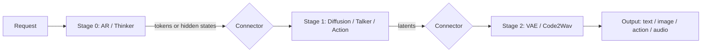

# nanovllm-omni

> A minimal, readable reference implementation of [vllm-omni](https://github.com/vllm-project/vllm-omni)'s stage-based serving architecture, covering AR (LLM), Diffusion (image), VLA (robot action), and Omni (audio) model families.

[](LICENSE)
[]()
[]()
[]()

---

## Why nanovllm-omni?

[vllm-omni](https://github.com/vllm-project/vllm-omni) extends vLLM with **stage-based execution** for omni-modal generation: a single request flows through multiple stages (AR reasoning → diffusion → codec decode), each with its own scheduler, batching, and memory policy. Understanding this design is the key to extending or building on vllm-omni.

`nanovllm-omni` is its **minimal companion**: ~2700 lines of code that mirror vllm-omni's design while staying readable end-to-end. If you've ever wanted to read vllm-omni top-to-bottom but gotten lost in CUDA-graph capture and Mooncake transports, this repo is for you.

### What you learn here

- How stage-based scheduling differs from single-stage serving
- How cross-stage state (KV cache, hidden states, action latents) flows through typed connectors
- How heterogeneous stages (AR + diffusion + action + audio codec) compose into one request
- Where vllm-omni's complexity is essential, and where it's accidental

---

## Supported models

| Role | Model | Stages | Output | Weights |
|---|---|---|---|---|
| AR (multimodal LLM) | Qwen2.5-VL-3B-Instruct | 1 | text | `Qwen/Qwen2.5-VL-3B-Instruct` |
| Diffusion (image gen) | SD3.5-medium | 1 | image | `stabilityai/stable-diffusion-3.5-medium` |
| Diffusion (image edit) | Qwen-Image-Edit | 1 | image | `Qwen/Qwen-Image-Edit` |
| VLA (robot policy) | InternVLA-A1-3B | 2-3 | action | `InternRobotics/InternVLA-A1-3B` |
| Omni (audio) | MiniMind-Omni-3o | **3** | **audio** | `jingyaogong/minimind-3o` |

**MiniMind-Omni is the canonical multi-stage demo**: it IS a 3-stage pipeline (Thinker → Talker → Code2Wav), exactly the architecture vllm-omni was built for.

---

## Quickstart

> ⚠️ Under active development. See [TODO.md](TODO.md) for current phase status.

```bash
# Install
pip install -e ".[dev]"

# Launch Gradio demo (downloads weights on first use)
python -m nanovllm_omni.serving.app

# Or use the CLI for a single stage
python examples/chat.py                          # AR (Qwen2.5-VL)
python examples/image_gen.py                     # Diffusion (SD3.5)
python examples/image_edit.py                    # Diffusion (Qwen-Image-Edit)
python examples/vla.py                           # VLA (InternVLA-A1)
python examples/audio.py                         # Omni (MiniMind-Omni)
python examples/multi_stage.py                   # Custom pipeline from YAML
```

Hardware target: **24 GB VRAM** (RTX 4090 / A10G). Lazy model loading via HF Spaces.

---

## Configuration

Pipelines are declared in YAML and loaded with `load_config`. The canonical
schema separates stage topology from deployment settings:

```yaml
pipeline:
  stages:
    - name: thinker
      kind: ar                 # ar | diffusion | action | audio_decode
      model_id: example/model
      model_kwargs:            # optional, passed to the stage loader
        dtype: bfloat16
    - name: decoder
      kind: audio_decode
      model_id: example/codec
  connectors:
    - source: thinker
      target: decoder
      payload_type: hidden_states  # optional; defaults to auto

deploy:
  device: cuda                 # defaults to cuda
  lazy_load: true              # defaults to true
  max_active_stages: 1         # defaults to 1
```

`pipeline.stages` is required and must be non-empty. Stage names must be
unique and stage kinds must be one of the four values shown above. Multiple
`ar` stages are allowed so MiniMind-Omni can declare Thinker and Talker as
separate autoregressive boundaries. Connector endpoints must name declared
stages. `connectors` and each stage's `model_kwargs` are optional. The loader
also accepts `deployment` as an alias for `deploy` and the deployment keys at
the top level for compatibility.

```python
from nanovllm_omni.config import load_config

pipeline, deploy = load_config("configs/pipeline.yaml")
print(pipeline.stages[0].model_id)
print(deploy.device, deploy.lazy_load, deploy.max_active_stages)
```

`load_config(path)` accepts a string or `pathlib.Path` and returns a
`(PipelineConfig, DeployConfig)` tuple. Missing deployment values use the
defaults above; invalid configuration shapes or values raise `ValueError`.

## Architecture overview

A request flows through a chain of stages, each owning its own model component, scheduler, and KV/cache state. Cross-stage state flows through typed connectors.



Three concrete deployments demonstrate the design:

1. **MiniMind-Omni** (3 stages): `Thinker (AR) → Talker (AR) → Code2Wav (audio decode)` — the canonical reference
2. **InternVLA-A1** (2-3 stages): vision encoder → AR reasoning → flow-matching action denoise
3. **Single-stage demos**: Qwen2.5-VL, SD3.5-medium, Qwen-Image-Edit

---

## Design mapping: nanovllm-omni ↔ vllm-omni

| vllm-omni component | nanovllm-omni location | What we simplified |
|---|---|---|
| `AsyncOmniEngine` | `runtime.py::Engine` | No background event loop; synchronous driver |
| `Orchestrator` | `orchestrator.py` | No streaming cancellation state machine |
| `StageRuntime` | `runtime.py::StageRuntime` | Single-process, single-device only; no cross-node |
| `OmniConnector` | `connector.py` | Shared-memory transport only; no Mooncake/Mori/Yuanrong |
| `PipelineConfig` + `DeployConfig` | `config.py` | Dataclass + YAML; CLI override via pydantic |
| `VllmOmniARStageConfig` | `stage.py::ARStage` | Direct `vllm.LLM` wrap; no model parallelism config |
| `OmniDiffusionConfig` | `diffusion/scheduler.py` | Request-level batching only; no CUDA graph |
| `MiniMindOmniForConditionalGeneration` | `models/audio.py` | Reference PR #3796; per-stage registration |
| Post-EOS bridge state | `orchestrator.py::PerRequestPostEOSState` | Per-request counter only |
| MTP codebook active mask | `models/audio.py::TalkerMTP` | ~80 LOC direct port |

Full table: [docs/design_mapping.md](docs/design_mapping.md) (filled in Week 5).

---

## Hardware

| Profile | VRAM | Models that fit |
|---|---|---|
| T4 Small | 16 GB | One model at a time, quantized |
| **A10G Small (recommended)** | **24 GB** | **Any single model; lazy switching** |
| A100 Large | 80 GB | All models concurrently |

For HF Spaces deployment we use **A10G Small** with on-demand model loading.

---

## Repository layout

```
nanovllm-omni/
├── nanovllm_omni/           # Main package
│   ├── config.py            # PipelineConfig + DeployConfig
│   ├── stage.py             # Stage ABC + AR/Diffusion/Action/AudioDecode
│   ├── pipeline.py          # Pipeline = ordered stages + connectors
│   ├── orchestrator.py      # Cross-stage request routing + per-request state
│   ├── runtime.py           # StageRuntime lifecycle + lazy loading
│   ├── connector.py         # Stage-to-stage transport (token + tensor payloads)
│   ├── diffusion/
│   │   ├── sampler.py       # Minimal flow matching + DDPM
│   │   ├── scheduler.py     # Diffusion request-level batching
│   │   └── audio_codec.py   # Mimi codec decoder (for MiniMind-Omni)
│   ├── models/
│   │   ├── ar.py            # Qwen2.5-VL-3B via vllm
│   │   ├── diffusion.py     # SD3.5-medium + Qwen-Image-Edit
│   │   ├── vla.py           # InternVLA-A1
│   │   └── audio.py         # MiniMind-Omni (Thinker/Talker/Code2Wav)
│   └── serving/
│       ├── app.py           # Gradio entry + lazy model dispatch
│       ├── chat.py          # Chat tab
│       ├── image.py         # T2I + Edit tabs
│       ├── vla.py           # VLA tab
│       └── audio.py         # Audio tab (MiniMind-Omni)
├── configs/                 # YAML stage configs
├── examples/                # Single-file scripts (CLI entry)
├── notebooks/               # 5 design walkthroughs
├── tests/                   # Unit + manual smoke tests
├── docs/                    # architecture.md, design_mapping.md, deployment.md
└── ...
```

LOC budget: ~2700 lines of code + 5 notebooks + 3 doc files. Every file has a "what it does and what it doesn't" header comment.

---

## Roadmap

6 weeks, 40 issues across 6 phases. See [TODO.md](TODO.md).

| Phase | Week | Focus | Issues |
|---|---|---|---|
| 1 — Foundation | W1 | scaffold + Stage ABC + CI | #1-#6 |
| 2 — AR Engine | W2 | Qwen2.5-VL via vllm | #7-#12 |
| 3 — Diffusion | W3 | SD3.5 + Qwen-Image-Edit + flow matching | #13-#18 |
| 4 — VLA | W4 | InternVLA-A1 + action diffusion | #19-#24 |
| 5 — MiniMind-Omni | W5 | **3-stage audio + post-EOS + MTP** | #M1-#M10 |
| 6 — Deploy + Polish | W6 | HF Spaces + lazy loading + notebooks | #25-#30 |

---

## Deployment

- **Local**: `python -m nanovllm_omni.serving.app` → `http://localhost:7860`
- **HF Spaces**: A10G Small with on-demand weight download from Hub

See [docs/deployment.md](docs/deployment.md).

---

## Notebooks

Five notebooks walk through the design:

1. `01_stage_pipeline_walkthrough.ipynb` — concepts + MiniMind-Omni as canonical example
2. `02_design_mapping.ipynb` — executable `nanovllm-omni ↔ vllm-omni` table
3. `03_action_diffusion.ipynb` — flow matching internals (for InternVLA-A1)
4. `04_minimind_omni_internals.ipynb` — 3-stage pipeline + post-EOS padding + MTP
5. `05_adding_a_new_model.ipynb` — template for adding new models

---

## Contributing

PRs welcome. **Readability first**: if a file exceeds its LOC budget and the extra lines aren't teaching something, cut them. See [TODO.md](TODO.md) for the open issue list.

---

## License

Apache 2.0. See [LICENSE](LICENSE).